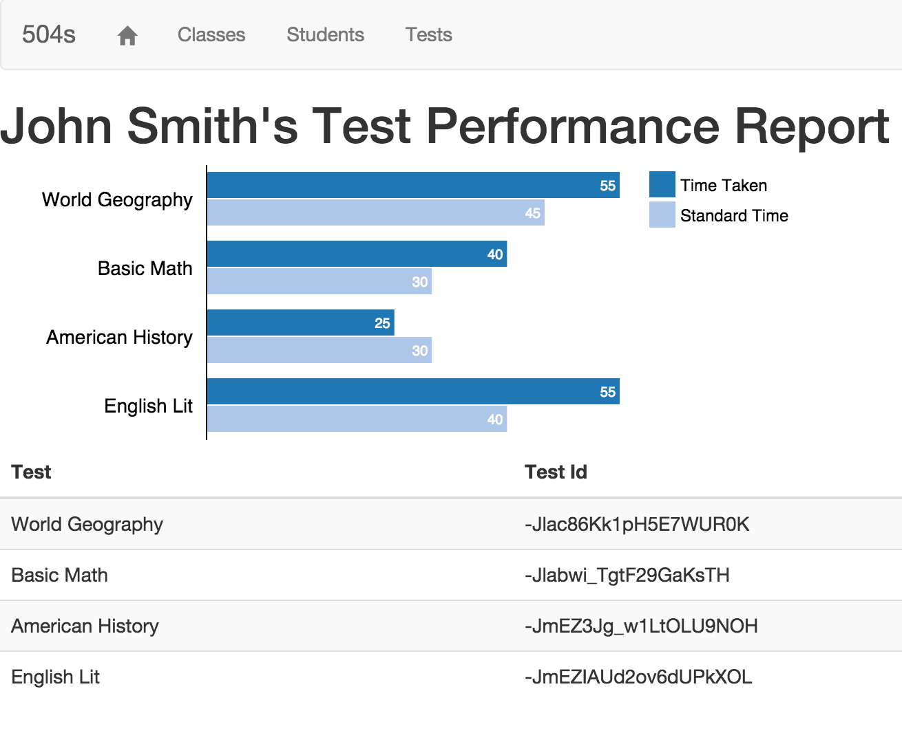
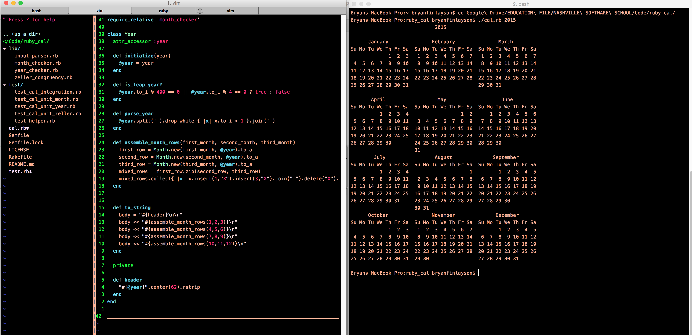

The projects below are a sample of my professional work as an apprentice software developer at the Nashville Software School.

* * *

504-Anecdotals
--------------
* View source code on [Github](https://github.com/bdfinlayson/504-anecdotals/ "504-Anecdotals")
* Take a [test drive](http://www.bryanfinlayson.com/code/504-anecdotals/#/login)
* See the [slideshow](https://docs.google.com/presentation/d/1Bt40Bz2e0Qe73Ucn0RL6U7bf0T2U6wff7YEisYQttVk/edit?usp=sharing)

The 504-Anecdotals app is designed for special education teachers who
need an easy way to track student time taken on tests and for supporting
the 504 process for test time extensions. The app was built for my
girlfriend, who is a special education teacher. 504-Anecdotals was my
Nashville Software School capstone for the first half of the program
covering the front-end stack (Javascript, HTML, and CSS). The app uses
Firebase as a backend. Built using Angularjs. The charts were built
using the D3 library. This is my Nashville Software School capstone for
the first half of the program covering the front-end stack (Javascript,
HTML, and CSS). The app uses Firebase as a backend. Built using
Angularjs. The charts were built using the D3 library.

* * *

Ruby Cal
--------
* View source code on [Github](https://github.com/bdfinlayson/ruby_cal/ "Ruby Cal")

The Ruby Cal project was my implementation of a subset of the Unix program, cal. Written in pure Ruby, I took a TDD approach to my implementation of the app using high-level integration tests and low-level unit tests. This project was part of Nashville Software School's Unit One capstone. Objectives included:

* Practice with Arrays, Hashes, and Strings
* Develop the logic of a non-trivial algorithm
* Programming to meet a (changing) specification 

